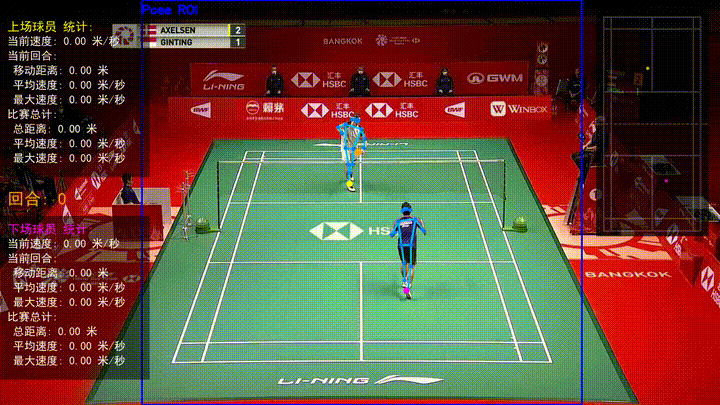

# Good-Badminton: AI 羽毛球鹰眼系统 🏸

<div align="center">

[](https://github.com/qwpyyx/Good-Badminton/stargazers)
[](https://github.com/qwpyyx/Good-Badminton/blob/main/LICENSE)

**基于计算机视觉的羽毛球比赛视频分析工具 | 一键 Web 界面，告别命令行**

</div>

> 🛠 Forked from [yo-WASSUP/Good-Badminton](https://github.com/yo-WASSUP/Good-Badminton) (Apache 2.0)，在此基础上做了大量改进。

## 🆕 本 Fork 改进

| 改进 | 说明 |
|------|------|
| 🌐 **Web 前端** | 一键启动 Flask 界面，浏览器里完成所有操作，不需要记命令行参数 |
| 🎨 **自适应球场检测** | 自动识别地板颜色（绿/红/橙/蓝），不再只支持绿色球场 |
| 📐 **手动标注 + 实时预览** | 点击四个角点即可标注球场，提交后立即看到绿色四边形反馈 |
| 🎬 **H.264 视频输出** | 输出视频可直接在浏览器/手机上播放，无需额外转码 |
| 📤 **拖拽上传** | 直接拖视频到页面即可上传分析 |
| 📊 **实时进度** | 进度条实时显示分析进度，不用盯着终端 |
| ✂️ **回合智能剪辑** | 自动检测回合，一键生成集锦视频或单独回合片段，去除捡球等冗余 |

## 🎬 效果预览



## 🚀 快速开始

### 1. 安装

```bash
# 克隆仓库
git clone https://github.com/qwpyyx/Good-Badminton.git
cd Good-Badminton

# 创建虚拟环境并安装依赖
python3 -m venv .venv
source .venv/bin/activate
pip install -r requirements.txt

# macOS 安装 FFmpeg（如果还没有）
# 下载: https://evermeet.cx/ffmpeg/
# 解压放到 ~/.local/bin/ 并加入 PATH
```

### 2. 下载模型权重

从 [yo-WASSUP/Good-Badminton Releases](https://github.com/yo-WASSUP/Good-Badminton/releases/latest) 下载：
- `yolo11s-ball.pt` → 放到 `weights/`
- `yolox_nano_8xb8-300e_humanart-40f6f0d0.onnx` → 放到 `weights/`

首次运行 YOLO pose 模型时会自动下载 `yolo11n-pose.pt`。

### 3. 启动 Web 界面（推荐 ✨）

```bash
source .venv/bin/activate
python app.py
```

打开 http://127.0.0.1:5050 即可使用。

### 4. 命令行方式（高级用户）

```bash
python main.py --video-path videos/demo.mp4
```

## 🌐 Web 界面使用指南

### 自动模式

1. 浏览器打开 http://127.0.0.1:5050
2. 点击选中视频（或拖拽上传新视频）
3. 点击 **「🔍 自动检测球场」** — 程序自动识别地板颜色和球场边界
4. 查看检测结果，如果边线准确，直接点 **「▶ 开始分析」**
5. 等待进度条完成，查看标注视频、热力图和散点图

### 手动修正模式

如果自动检测的球场边线不准确：

1. 点击 **「✏️ 手动修正」**
2. 在图片上按顺序点击球场四个角点：
   - **1️⃣ 左上角** (红点)
   - **2️⃣ 右上角** (绿点)
   - **3️⃣ 右下角** (蓝点)
   - **4️⃣ 左下角** (黄点)
3. 点击 **「✅ 确认提交」** — 会显示绿色四边形预览
4. 确认边线正确后，点击 **「▶ 开始分析」**

> 💡 角点要选 **球场边界白线的交点**，不是看台或广告牌。

### 回合剪辑模式

分析完成后，结果面板会显示检测到的回合数。可以一键生成剪辑：

- **集锦视频**：所有回合拼接为一个视频，自动去除捡球和回放
- **单独回合**：每个回合输出为独立 mp4 文件
- 剪辑前后保留 1.5 秒缓冲，确保动作完整

> 💡 长视频建议先用剪辑模式定位回合，再对关键回合做精确分析。

## ✨ 功能

- **球员姿态检测** — 支持 RTMPose、RTMO 和 YOLO Pose，识别人体关键点
- **羽毛球检测** — YOLO 模型检测羽毛球位置并绘制轨迹
- **球场坐标映射** — 自动/手动标注球场，将图像坐标映射到标准球场坐标
- **自适应球场颜色** — 自动识别绿/红/橙/蓝等不同颜色的球场地板
- **球员追踪** — 分别追踪上下半场球员，记录移动轨迹
- **回合检测** — 根据球场视图自动判断回合开始和结束
- **运动统计** — 移动距离、速度、最大速度、回合数量
- **可视化输出** — 带骨架、轨迹、统计覆盖层的标注视频 (H.264)
- **位置图表** — 热力图和散点图
- **中英文** — 可视化文字可切换

## 📋 系统要求

- Python 3.8+
- FFmpeg（加入 PATH）
- 模型权重从 [Releases](https://github.com/yo-WASSUP/Good-Badminton/releases/latest) 下载

**推荐配置：**
- GPU 6GB+ 显存；或 Apple Silicon Mac (MPS)
- 16GB+ 内存
- CPU 也能跑，但 4K 视频会较慢（约 10-20 分钟/20 秒视频）

## 📊 输出结果

默认输出到 `outputs/<视频文件名>/`：

```
outputs/demo/
├── detect_demo.mp4          # 标注视频 (H.264, 浏览器可播)
├── detections.jsonl          # 逐帧检测数据
├── auto_court_preview.png    # 球场检测预览
├── manual_court_preview.png  # 手动标注预览
├── court_annotations.txt     # 球场坐标缓存
├── metadata.json             # 运行元数据
├── rally_segments.json       # 回合分段数据
├── clips/                    # 回合剪辑输出
│   ├── highlights.mp4        # 集锦视频（所有回合合并）
│   └── rally_001.mp4         # 单个回合片段
└── position_visualizations/
    ├── heatmaps/             # 热力图
    └── scatter_plots/        # 散点图
```

## 🧩 项目结构

```text
app.py               # 🌐 Web 前端入口（推荐）
main.py              # 命令行入口
court_detect.py      # 无头球场检测脚本
clip_video.py        # ✂️ 回合视频剪辑脚本
web_ui.html          # 前端页面
badminton_analysis/
├── system.py        # 分析主流程
├── court/           # 球场检测与坐标映射 (自适应颜色)
├── data/            # JSON/JSONL 输出
├── detection/       # 羽毛球 & 姿态检测
├── media/           # 视频 & 音频处理 (H.264)
├── tracking/        # 球员追踪
└── visualization/   # 叠加层、统计图、位置图
```

## 🔧 命令行参数（高级）

```text
--video-path              输入视频路径
--template-path            球场模板图（可选，会自动提取）
--output-dir               输出目录，默认 outputs/<视频名>
--pose-family              rtmpose / rtmo / yolo-pose
--pose-mode                lightweight / balanced / performance
--language                 zh / en
--display false            关闭 OpenCV 窗口（服务器模式）
```

## 🙏 致谢与许可

本项目 Fork 自 [yo-WASSUP/Good-Badminton](https://github.com/yo-WASSUP/Good-Badminton)。

- RTMPose、RTMO 和 OpenMMLab 生态
- [Ultralytics YOLO](https://github.com/ultralytics/ultralytics)
- [Tau-J/rtmlib](https://github.com/Tau-J/rtmlib)
- [yastrebksv/TrackNet](https://github.com/yastrebksv/TrackNet)

**许可证**：
- 原始代码：[Apache License 2.0](https://github.com/yo-WASSUP/Good-Badminton/blob/main/LICENSE)
- 本 Fork 新增/修改代码：[CC BY-NC 4.0](https://creativecommons.org/licenses/by-nc/4.0/) — **禁止商用**
